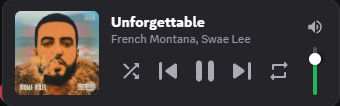
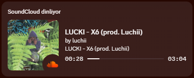

# MusicControls

Control **Spotify**, **YouTube Music**, and **SoundCloud** from inside Discord.  
A player sits above your account panel — see what's playing, skip, seek, adjust volume, shuffle, repeat. Works with all three services at once.



Rich presence shows on your Discord profile so others can see what you're listening to.



---

## What You Need

- Discord **desktop app** (not the browser version)
- A **Chromium browser** (Chrome, Edge, or Brave — not Firefox)
- Spotify connected to Discord (only for Spotify support)

---

## Installation

### Step 1 — Set up Vencord from source

You need the **source version** of Vencord (not the easy one-click installer — that one doesn't support custom plugins).

**1. Install the tools** (do each one, then open a fresh Command Prompt to check it works):

- **Git** → https://git-scm.com/download/win — click Next through everything  
  Check: `git --version` should print a version number

- **Node.js (LTS)** → https://nodejs.org — click Next through everything  
  Check: `node --version` should print something like `v20.x.x`

- **pnpm** → open Command Prompt and run:
  ```
  npm install -g pnpm
  ```
  Check: `pnpm --version` should print a version number

**2. Download Vencord** — open Command Prompt and run these one by one:
```
cd %USERPROFILE%\Desktop
git clone https://github.com/Vendicated/Vencord
cd Vencord
pnpm install
```

---

### Step 2 — Add the plugin

1. Open File Explorer and go into your `Vencord` folder, then into `src`
2. If there's no `userplugins` folder inside `src`, create one (right-click → New Folder → name it `userplugins`)
3. Copy the **`MusicControl`** folder into `userplugins` so it looks like this:
   ```
   Vencord/src/userplugins/MusicControl/
   ```

---

### Step 3 — Build and inject

In Command Prompt, make sure you're inside the `Vencord` folder, then run:
```
pnpm build
pnpm inject
```
When `pnpm inject` runs, a window appears listing your Discord installations — select **Discord** and press Enter. It will say "Injected successfully".

Open Discord. You should now see a **Vencord** section in Discord Settings.

---

### Step 4 — Enable the plugin

Discord Settings → **Plugins** → find **MusicControls** → toggle it **on**.

---

### Step 5 — Install the browser extension

The extension is what lets Discord see what's playing in YouTube Music and SoundCloud.

1. Open your browser and go to `chrome://extensions` (or `edge://extensions` for Edge)
2. Turn on **Developer mode** using the toggle in the top-right corner
3. Click **Load unpacked**
4. Select the `musicControls/extension` folder
5. The extension is now active — you'll see its icon in your browser toolbar

> Keep this extension enabled at all times. If it gets disabled (can happen after browser updates), go back to `chrome://extensions` and re-enable it.

---

### Step 6 — Connect Spotify (optional)

Spotify uses Discord's built-in connection — no extension needed.

Discord Settings → **Connections** → click the Spotify icon → log in.  
That's it. Spotify will appear in the player automatically when something is playing.

---

## Credits

| What | Source |
|---|---|
| **SpotifyStore** (Spotify playback state, API calls, device tracking) | Taken and modified from Vencord's built-in [SpotifyControls](https://github.com/Vendicated/Vencord) plugin — original authors: Ven, afn, KraXen72, Av32000, nin0dev |
| **Vencord plugin system** (definePlugin, patches, FluxDispatcher, useStateFromStores) | [Vencord](https://github.com/Vendicated/Vencord) by Vendicated — GPL-3.0 |
| **Discord IPC RPC protocol** | Implementation pattern from [discord-rpc](https://github.com/xHayper/discord-rpc) and [soundcloud-rpc](https://github.com/richardhbtz/soundcloud-rpc) |

All TypeScript source files carry the original Vencord GPL-3.0 copyright header. This project is licensed under GPL-3.0 in accordance with Vencord's license.

---

## Plugin Settings

Discord Settings → Plugins → MusicControls:

| Setting | What it does |
|---|---|
| **Use Spotify URIs** | Opens Spotify app instead of browser when clicking a track |
| **Previous button restarts track** | If 3+ seconds into a track, pressing previous restarts it instead of going back |
| **Enable Rich Presence** | Shows "Listening to SoundCloud/YouTube Music" on your Discord profile |
| **Presence priority** | If both SoundCloud and YouTube Music are playing, which one shows on your profile |

---

## Troubleshooting

**Player doesn't appear in Discord**
- Make sure the plugin is enabled in Discord Settings → Plugins
- Make sure you ran `pnpm build` after copying the plugin folder, then fully restarted Discord
- Try toggling the plugin off and back on

**YouTube Music or SoundCloud not showing**
- Check the extension is installed and enabled at `chrome://extensions`
- Make sure you have a YouTube Music or SoundCloud tab open with something playing
- Try refreshing the music tab

**Buttons are slow or don't work**
- There is a small built-in delay (~150ms) while the command travels from Discord to your browser
- Make sure the extension is running in the same browser as your music

**Vencord disappeared after Discord updated**
- Discord auto-updates and removes Vencord. Just run `pnpm inject` again in your Vencord folder and restart Discord.

**Extension disabled after browser updated**
- Go to `chrome://extensions`, find MusicControls, click Enable

**"Listening to..." not showing on profile**
- Make sure "Enable Rich Presence" is on in plugin settings
- Make sure your Discord status is not set to Invisible
